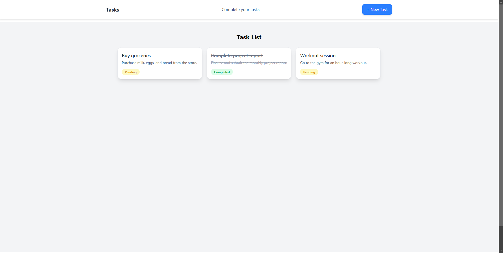

# 📋 Task Management Application

## 🌟 Overview
A lightweight, efficient task management application built with the MERN stack, allowing users to create, update, delete, and track tasks seamlessly.


## 🖥️ Live Demo
*[Live Link](https://task-full-f7f3.vercel.app/)*

## 🖥 API Documentation
*[API Endpoint Docs](https://documenter.getpostman.com/view/39575061/2sAYkKJdKj)*

## ✨ Features
- 🆕 Create new tasks
- ✏️ Edit existing tasks
- 🗑️ Delete tasks
- ✅ Mark tasks as completed
- 📋 View all tasks in a clean, intuitive interface

## 📸 Screenshots


## 🛠️ Technologies
### Frontend
- React.js
- Tailwind CSS
- Axios
- Vite

### Backend
- Node.js
- Express.js
- MongoDB
- Mongoose

### Development Tools
- ESLint
- Prettier
- Git

## 📂 Project Structure
```
task-app/
├── backend/
│   ├── config/         # Configuration files
│   ├── controllers/    # Business logic
│   ├── models/         # Database models
│   ├── routes/         # API route definitions
│   ├── routes/         # Express server
│   └── .env            # Environment variables
│
└── frontend/
    ├── src/
    │   ├── components/ # Reusable React components
    │   ├── pages/      # Page components
    │   ├── services/   # API service hooks
    │   └── main.jsx    # Entry point
    └── vite.config.js  # Vite configuration
```

## 🔗 API Endpoints

| Method | Endpoint         | Description             |
|--------|------------------|-------------------------|
| GET    | `/api/tasks`     | Retrieve all tasks      |
| POST   | `/api/tasks`     | Create a new task       |
| PUT    | `/api/tasks/:id` | Update an existing task |
| DELETE | `/api/tasks/:id` | Delete a task           |

## 🔧 Getting Started

### Prerequisites
- Node.js (v16+)
- npm 
- MongoDB

### Installation

1. Clone the Repository
```bash
git clone https://github.com/Pritthish20/task-full.git
cd task-management-app
```

2. Setup Backend
```bash
cd backend
npm install
# Create .env file with your MongoDB URI
npm start
```

3. Setup Frontend
```bash
cd frontend
npm install
npm run dev
```

## 📞 Contact
*[Pritthish Sarkar / pritthishps20@gmail.com]*